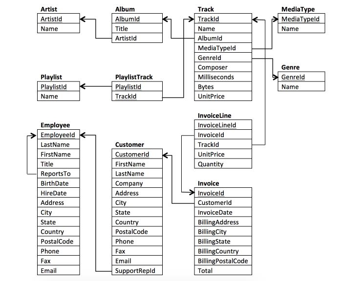

# ⭐ The-Chinook-Digital-Music-Store-Database ⭐

## Table of Contents
- [Overview](https://github.com/Ratafar22/Querying-a-Digital-Music-Store-Database#overview)
- [Data Source](https://github.com/Ratafar22/Querying-a-Digital-Music-Store-Database#data-source)
- [Tools](https://github.com/Ratafar22/Querying-a-Digital-Music-Store-Database#tools-used)
- [Skills](https://github.com/Ratafar22/Querying-a-Digital-Music-Store-Database#skills-and-concepts-demonstrated)
- [Business Questions and Answers](https://github.com/Ratafar22/Querying-a-Digital-Music-Store-Database#business-questions-and-answers)
- [Medium Article](https://github.com/Ratafar22/Querying-a-Digital-Music-Store-Database#medium-article)

## Overview
This is my second project in my Business Analytics Nanodegree Program at Udacity. I was tasked with helping the Chinook team understand their store's media, customers and employees, and their invoice information.

Below is the database schema

## Data Source 
The database can be gotten from [here](Chinook.db)

## Tools Used
- SQLite
- Power BI
  
## Skills and Concepts demonstrated
- SubQueries
- CTEs
- Aggregation and JOIN
- Data Visualization
  
## Business Questions And Answers

[Solution](https://github.com/Ratafar22/Querying-a-Digital-Music-Store-Database/blob/main/Business%20Questions%20and%20Answers.md)

## Data Visualization

## Medium Article

[Medium]()
